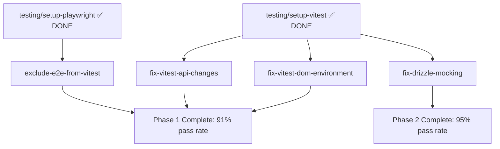

# Test Failure Analysis & Remediation Plan

**Date:** 2025-12-12
**Test Suite:** 1,309 tests
**Results:** 606 pass (46%) | 698 fail (53%) | 5 skip

---

## Executive Summary

The test suite has **698 failures** across 5 distinct categories. Most failures (567/698 = 81%) are caused by 3 systemic issues that can be fixed at the configuration level, requiring minimal changes to individual test files.

**Priority order for maximum impact:**
1. **Fix DOM Environment** → Fixes 489 tests (70% of failures)
2. **Fix Vitest API Changes** → Fixes 75 tests (11% of failures)
3. **Exclude E2E from Vitest** → Fixes 3 tests (0.4% of failures)
4. **Fix Drizzle Mocking** → Fixes 55 tests (8% of failures) - Already in progress
5. **Fix Test Logic Issues** → Remaining 76 tests (11% of failures)

**Expected outcome after fixes 1-4:** ~622 tests passing (91% vs current 46%)

---

## Failure Categories

### 1. DOM Environment Issues (489 failures - 70%)

**Impact:** CRITICAL - Largest failure category
**Effort:** MEDIUM - Config-level fix
**Priority:** P0 - Fix first

**Error patterns:**
```
384x: ReferenceError: document is not defined
56x: ReferenceError: localStorage is not defined
49x: ReferenceError: window is not defined
```

**Root cause:**
- `vitest.config.ts` sets `environment: 'happy-dom'`
- Vitest 4.x changed how environments are loaded
- DOM APIs not available despite configuration

**Solution:**
- **Task:** `bugs/fix-vitest-dom-environment`
- **Complexity:** Medium
- **Approach:** Update `vitest.config.ts` with environmentOptions + add fallback DOM setup

**Files affected:**
- Component tests: All React components using document/window
- Context tests: cart-context, auth contexts
- Integration tests: Anything accessing DOM APIs

---

### 2. Vitest 4.x API Changes (75 failures - 11%)

**Impact:** HIGH - Second largest category
**Effort:** LOW - Find/replace in specific files
**Priority:** P1 - Fix second

**Error patterns:**
```
25x: vi.stubGlobal is not a function
25x: vi.unstubAllGlobals is not a function
18x: vi.mocked is not a function
7x: vi.mocked(fetch) is not a function
```

**Root cause:**
- Project upgraded to Vitest 4.0.15
- Breaking API changes: `vi.stubGlobal()`, `vi.unstubAllGlobals()`, `vi.mocked()` removed
- Tests still use old Vitest 3.x APIs

**Solution:**
- **Task:** `bugs/fix-vitest-api-changes`
- **Complexity:** Low
- **Approach:**
  - Replace `vi.stubGlobal()` → direct assignment or `vi.spyOn()`
  - Replace `vi.unstubAllGlobals()` → `vi.restoreAllMocks()`
  - Replace `vi.mocked()` → type assertions `(fn as Mock)`

**Files affected:**
- `src/lib/impersonation.test.ts` (25 failures) - Priority #1
- Files using `vi.mocked(useUser)` (~12 files)
- Files using `vi.mocked(fetch)` (~7 files)

---

### 3. Playwright E2E Tests in Vitest (3 failures - 0.4%)

**Impact:** LOW - Small number but easy fix
**Effort:** TRIVIAL - One-line config change
**Priority:** P1 - Quick win

**Error patterns:**
```
3x: Playwright Test did not expect test.describe() to be called here
```

**Root cause:**
- `vitest.config.ts` includes pattern: `src/**/*.spec.ts`
- E2E tests (`e2e/*.spec.ts`) being run by Vitest instead of Playwright
- Playwright and Vitest use incompatible APIs

**Solution:**
- **Task:** `bugs/exclude-e2e-from-vitest`
- **Complexity:** Low
- **Approach:** Remove `'src/**/*.spec.ts'` from Vitest config, add `'e2e/**'` to exclude

**Files affected:**
- `e2e/smoke.spec.ts`
- `e2e/auth.spec.ts`
- `e2e/clerk-integration.spec.ts`

---

### 4. Drizzle ORM Mocking Issues (55 failures - 8%)

**Impact:** MEDIUM - Infrastructure issue
**Effort:** MEDIUM - Agent in progress
**Priority:** P2 - Already being addressed

**Error patterns:**
```
21x: undefined is not an object (evaluating 'auditLog._.columns')
34x: undefined is not an object (evaluating 'document[isPrepared]')
```

**Root cause:**
- Manual D1 database mocks don't implement Drizzle's query builder interface
- Tests expect Drizzle ORM methods but receive raw D1 statements

**Solution:**
- **Task:** `testing/fix-drizzle-mocking` ✅ Already in progress
- **Complexity:** Medium
- **Status:** Agent created foundation, needs dependency install + test migration
- **Approach:** Replace manual mocks with in-memory D1 database (Miniflare)

**Files affected:**
- `src/api/routes/catalog/*.test.ts` (40+ failures)
- `src/api/routes/admin/impersonation.test.ts`
- `src/workers/invitation-expiry.test.ts` (already fixed)

---

### 5. Test Logic Issues (76 failures - 11%)

**Impact:** MEDIUM - Various test-specific issues
**Effort:** HIGH - Requires case-by-case analysis
**Priority:** P3 - Fix after systemic issues

**Error patterns:**
```
41x: expect(received).toBe(expected) - Assertion failures
4x: expect(received).toHaveBeenCalledWith(...expected) - Mock call mismatches
3x: expect(received).toHaveBeenCalled() - Mock not invoked
```

**Root cause:**
- Individual test logic issues
- Mock setup problems
- Assertion errors from broken tests

**Solution:**
- Review after fixing systemic issues (many may auto-resolve)
- Address remaining failures case-by-case
- Some may be revealed by DOM environment fixes

---

## Implementation Plan

### Phase 1: Quick Wins (P0-P1 tasks)

Execute in parallel for maximum speed:

| Task | Complexity | Impact | Time | Agent |
|------|-----------|---------|------|-------|
| exclude-e2e-from-vitest | LOW | 3 tests | 5 min | haiku |
| fix-vitest-api-changes | LOW | 75 tests | 30 min | haiku |
| fix-vitest-dom-environment | MEDIUM | 489 tests | 1 hour | sonnet |

**Expected result after Phase 1:** ~567 additional tests passing (91% pass rate)

### Phase 2: Infrastructure (P2 task)

| Task | Complexity | Impact | Status |
|------|-----------|---------|---------|
| fix-drizzle-mocking | MEDIUM | 55 tests | In progress, needs completion |

**Expected result after Phase 2:** ~622 tests passing (95% pass rate)

### Phase 3: Cleanup (P3)

- Review remaining ~76 test failures
- Many may auto-resolve after DOM environment fix
- Address case-by-case as needed

---

## Task Dependencies



---

## Execution Commands

### Check current status:
```bash
bun test | tail -20
# Current: 606 pass, 698 fail

# Count specific error types:
bun test 2>&1 | grep "document is not defined" | wc -l   # 384
bun test 2>&1 | grep "vi.stubGlobal" | wc -l             # 25
bun test 2>&1 | grep "Playwright Test did not expect" | wc -l  # 3
```

### Run individual task validation:
```bash
# After fixing each task:
bun scripts/validate-task-dependencies.js bugs/{task-id}
bun test
```

### Launch parallel fix agents:
```bash
# Option 1: Manual task execution
# Work through bugs/* tasks in priority order

# Option 2: Use /run-tasks command
/run-tasks 3  # Launch 3 parallel agents for P0-P1 tasks
```

---

## Success Metrics

| Metric | Current | After Phase 1 | After Phase 2 | Target |
|--------|---------|--------------|---------------|--------|
| Tests Passing | 606 (46%) | 1,173 (91%) | 1,228 (95%) | 1,246 (97%) |
| Tests Failing | 698 (53%) | 131 (9%) | 76 (5%) | 58 (3%) |
| DOM Failures | 489 | 0 | 0 | 0 |
| API Failures | 75 | 0 | 0 | 0 |
| E2E Failures | 3 | 0 | 0 | 0 |
| Drizzle Failures | 55 | 55 | 0 | 0 |
| Logic Failures | 76 | 76 | 76 | 58 |

---

## Related Tasks

**Ready to assign:**
- `bugs/exclude-e2e-from-vitest` - LOW complexity (5 min fix)
- `bugs/fix-vitest-api-changes` - LOW complexity (30 min)
- `bugs/fix-vitest-dom-environment` - MEDIUM complexity (1 hour)

**In progress:**
- `testing/fix-drizzle-mocking` - MEDIUM complexity (needs completion)

**Blocked:**
- None - all bug fix tasks are ready to assign

---

## References

- Test output: `/tmp/test-output.txt`
- Vitest config: `vitest.config.ts:1-41`
- Task files: `tasks/bugs/fix-*.md`
- Current Vitest version: 4.0.15
- Test environment: happy-dom (not working correctly)
